# Atelier
Front End Capstone

**OVERVIEW:**
Atelier is our Front End Capstone project. It is a single page application written in React, with an Express and Nodejs server running in the background. This repo comprises four widgets and is a clone of Target.com’s product pages. It uses an external API to make real-time calls and return product data and information.
This repo comprises four widgets that create a single product page for our organization.

**Table of Contents**
*[Overview Widget](#Overview)
*[Related Products Widget](#RelatedProductsWidget)
*[Questions Widget Widget](#QuestionsWidget)
*[Ratings And Reviews Widget](#RatingsAndReviewsWidget)
*[Installation](#Installation)
*[Team Members](#TeamMembers)
*[RoadMap](#RoadMap)

**#Overview Widget:**
Users can view a detailed description of the product and see its price, availability, and other relevant details.
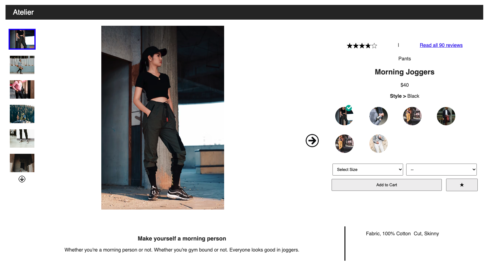

The far left side of the widget holds a vertical thumbnail gallery to see the product in different settings and angles. The up and down arrows only appear dependant on the current thumbnail selection. That is, the arrows appear when the user can travel "up" or "down" in the thumbnail selection.
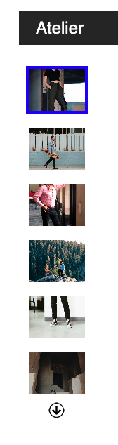
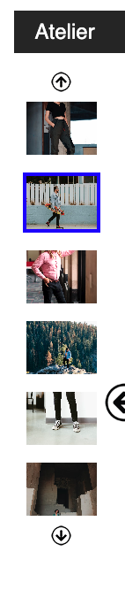

The main image had similarly functioning left and right arrows, again only displaying when the option is available for the user. Upon clicking the main image, the user is taken to an expanded view where they can continue to navigate throught the images or they can zoom the image to view it better.
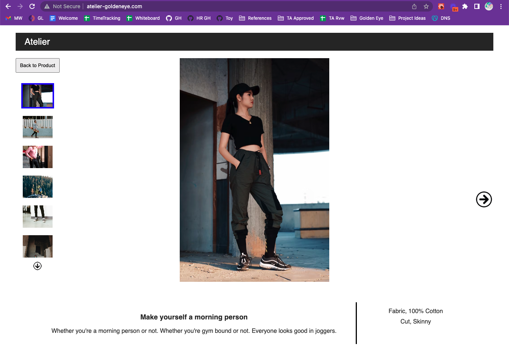

The right side shows its total star rating, a link to read all reviews (toward the bottom of the page) and some of the initial details about the product like the title of the style and the category. Below this is a style selector where the user can toggle through styles which also renders several photos that correlate with that style.
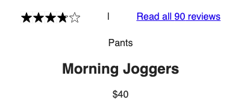
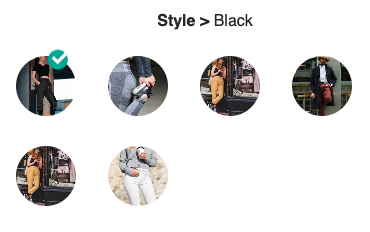

Finally, in this section you can see a set of selections, a star button to toggle your outfit to the carousel below, and an "Add-To-Cart button" to add the sku(s) to the cart.
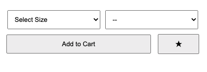

Underneath these two sections is a product slogan, description, and a few features.

**#Related Products Widget:**
This section displays similar products that users may be interested in. This wonderful carousel slides to the right and left. This is an ambi-turner. Each product displayed has an image, price, star rating, and an ability to "like" the product. The carousel

This section contains 2 carousels: 'Related Products' and 'Your Outfit'

The Related Products Carousel: Displays products related to the item currently being viewed in the Overview. The carousel does not have a limit to the number of related products it can contain and overflows to give a seamless and endless effect. The Related Product Cards within the carousel contain key information including category, product name, price, and overall star rating. At the top right of each card is a Star icon that when clicked opens up a comparison modal that compares the unique qualities of the current product in over and the related product selected.

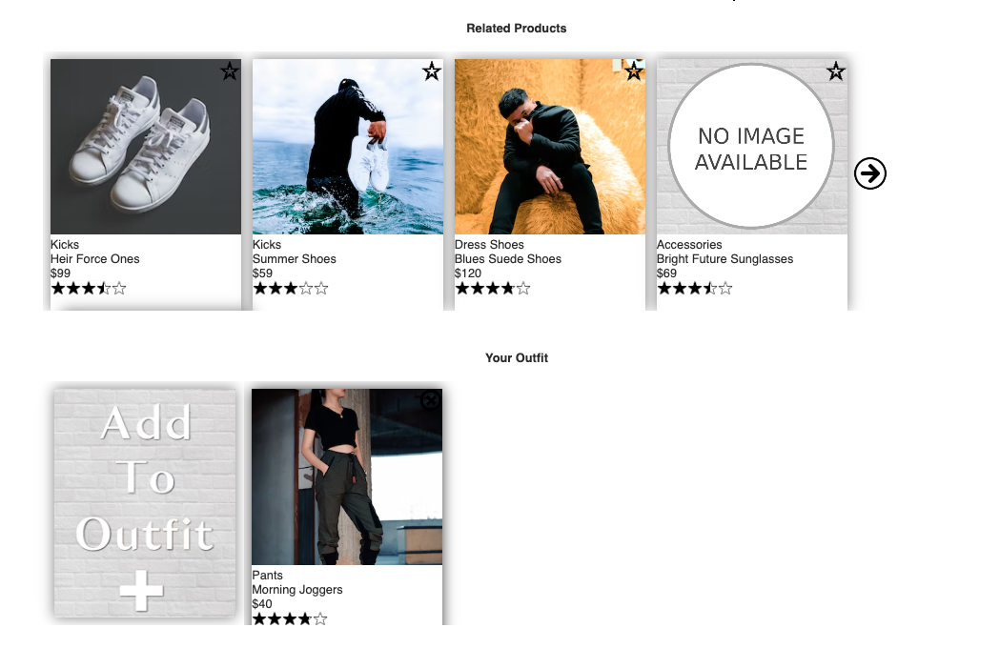

Your Outfit Carousel: Displays a clickable card icon that when clicked adds the current product in the Overview section to a carousel to create a unique outfit. This widget allows for persistent data such that when a client adds an item to their outfit, it will remain upon a return to the site.

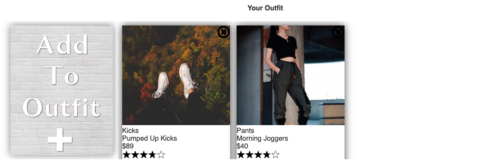

**#Questions Widget:**
This widget allows users to ask and answer questions about the product.
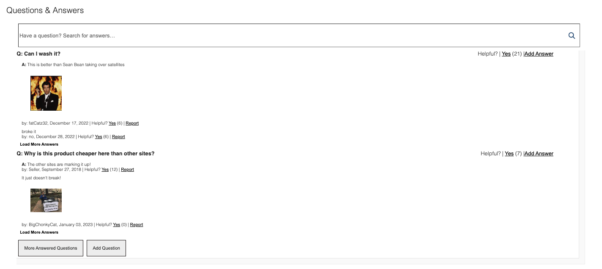

The top of this wight has a search bar that searches all of the questions asked about the widget. It only fires after three characters are written.
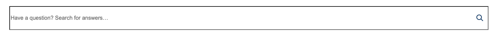

Two questions are displayed at the start, but all can be loaded. Each question has two answers also displayed, but all can also be viewed as expanded.

Answers can display images as well.

Users can click on the helpfulness of questions and add answers.

Answers can be reported and removed from the question until our Customer Satisfaction Team can review.
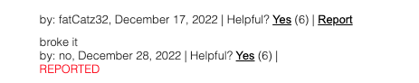

At the bottom there is a button to add a question. Both questions and answers are created in a pop-up modal that can only be submitted if all necessary information is entered.
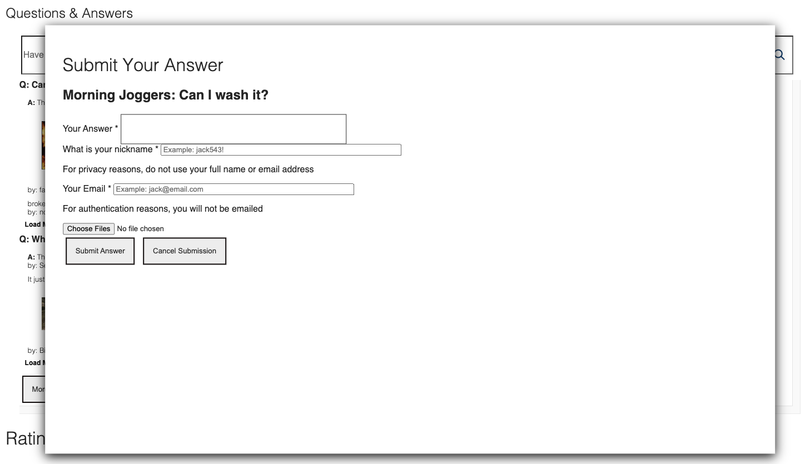

**#Ratings and Reviews Widget:**
The reviews section enables users to read and write reviews of the product.  Ratings section displays the overall star rating as well as the breakdown of ratings and characteristics of the item.
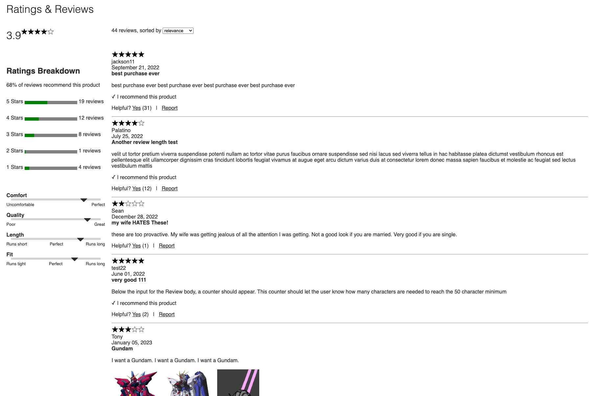

Initially, 2 reviews are shown (if available).  Clicking on the "More Reviews" button will allow 2 more reviews to be displayed until there are no more reviews to be shown and then that button will disappear.  Each review shows a graphical representation of the rating, name of reviewer, date, summary, and the review itself with pictures if present.  The user can also mark a review as helpful or report the review.
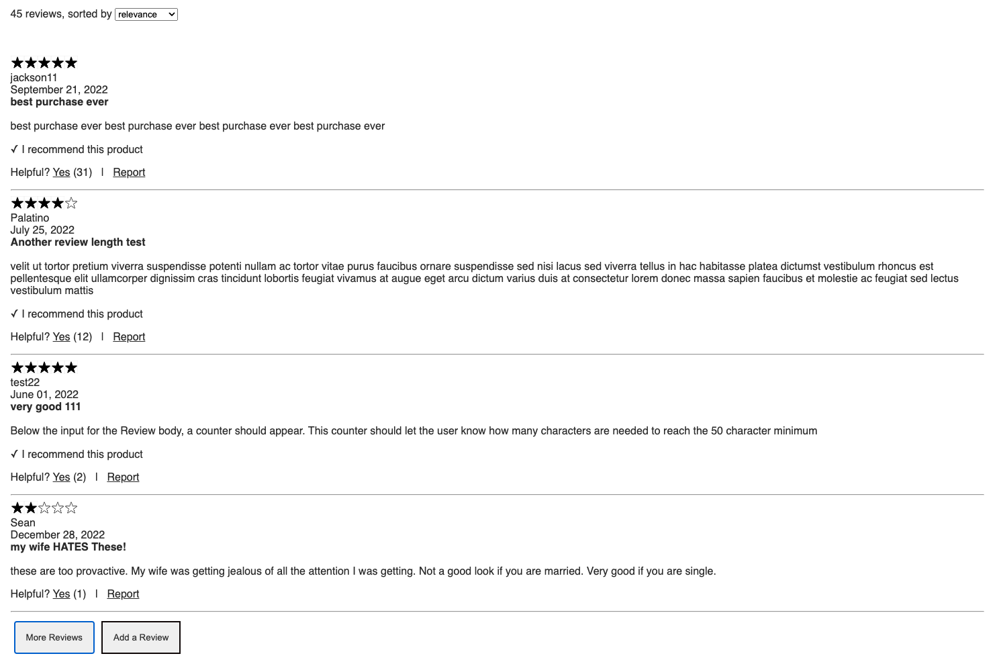

Clicking on the thumbnail photo in the review will open a larger photo in a modal.
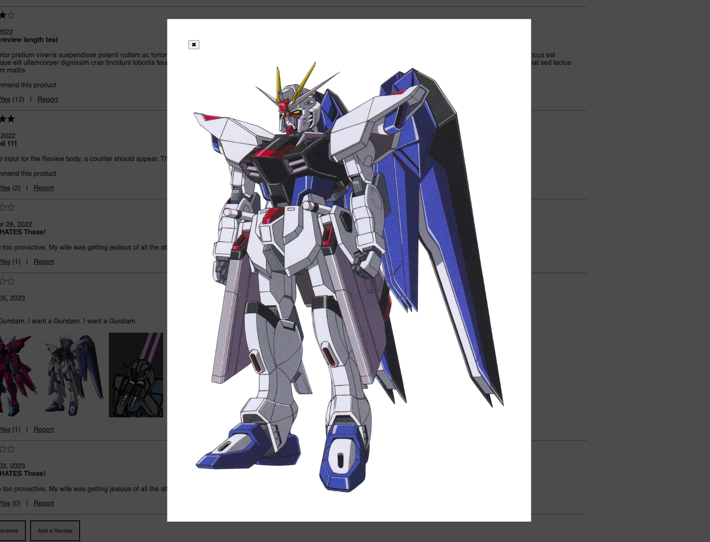

Clicking on the rating distribution bar applies filters to the list of displayed reviews for the rating that is chosen. The filtering is additive and subtractive and can be cleared by clicking on the bar again, or clicking the buttons that appear after filters are turned on.
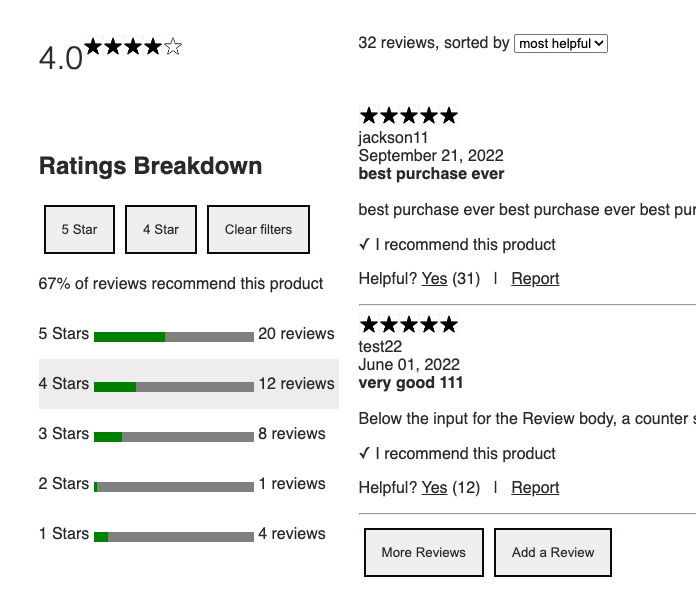

The ratings can also be sorted by relevance, helpfulness, or recency. Ratings are sorted by relevance by default.
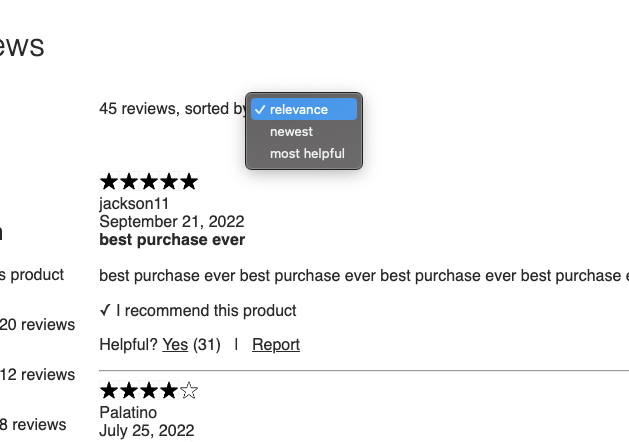

Clicking the "Add a Review" button displays a modal that contains a form that allows the user to submit a review for the product.  The form is dynamic and changes descriptions based on user input and selection.  Photos can be attached and are previewed to the user.

**#Installation:**
To run Atelier, make sure you have Nodejs and npm installed on your machine. Then, clone the repository and navigate to the root directory. Run npm install to install all necessary dependencies, and then npm start to start the server. “npm run client-dev” will compile the react application. The app will be available at http://localhost:3000.

We hope you enjoy using Atelier! If you have any issues or suggestions, please don't hesitate to reach out.

**#Team Members:**
* Brian Kuzma: Questions
* Aaron Miller: Related Products
* Mindi Weik: Overview
* Thomas Van: Reviews

**#Road Map:**
This product page is ready to ship and be fully integrated into the larger org website. Additional extra functionality can be added with more time for the team.

**#License:**
  * @license React v17.0.2
      This source code is licensed under the MIT license found in the
  * LICENSE file in the root directory of this source tree.
